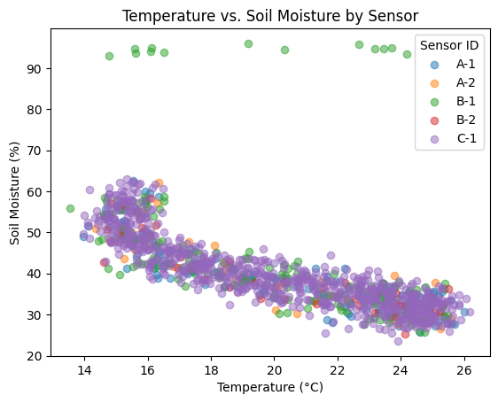

# Lab 05: Answer Sheet

## Question 1: How many rows were generated? How many were expected? Why?

**Answer:**  
3605 rows were generated. 3605 rows were expected, because the rows are generated base on 5 plants each hour of each day from 2023-07-01 00:00:00 to 2023-07-31 00:00:00. (30*24+1)*5 = 3605

---

## Question 2: What appears to be the unit of temperature, soil_moisture, and light_level?

**Answer:**  
The units are as follows:
- Temperature: degrees Celsius (°C)
- Soil Moisture: percentage (%)
- Light Level: lux (lx)
---

## Question 3: What is the difference between the mean and median moisture reading? Given the system's purpose, why might you expect these values to differ?

**Answer:**  
The difference is ~1.85.
Because noise is added to simulate realistic data.

---

## Question 4: After converting the timestamp column, what methods are now available on df['timestamp'].dt?

**Answer:**  
* df['timestamp'].dt.date
* df['timestamp'].dt.time
* df['timestamp'].dt.timetz
* df['timestamp'].dt.year
* e.t.c.

---

## Question 5: Justify the reason behind your choice.

**Answer:**  
For soil moisture, timestamps, temperature_c, light_level, temperature_f are all numerical values so interpolate is used, for sensor_id it is a object so fillna is used to fill all NaN as 'Null'.

---

## Question 6: Which sensor is in the driest environment on average? Which plant type requires the most water?

**Answer:**  
Sensor B-2 is in the driest environment on average with mean soil_moisture around 39.09%. The plant type that requires the most water is Monstera with 249 pump activation.

---

## Question 7: Looking at your line plot, describe the daily pattern of soil moisture. What does it tell you about the environment and the watering system?

**Answer:**  
Moisture level is highest at night, and gradually decreases in daytime. Daytime temperature is high and promotes evaporation. 

---

## Question 8: What does the histogram tell you about the temperature environment? Based on the scatter plot, what is the general relationship between temperature and soil moisture?

**Answer:**

**Histogram Analysis:**  
The temperature usually stays at 15C and 24.5C.

**Scatter Plot Analysis:**  
As temperature decreases, the soil moisture increases. There are outliers that remains >90% throughout different temperatures.

---

## Final Challenge: 

**Visualizations**  
  
**A short paragraph justifying which sensor you believe is faulty**  
Most outliers are created by sensor B-1, so it's most likely to be the faulty one.  
